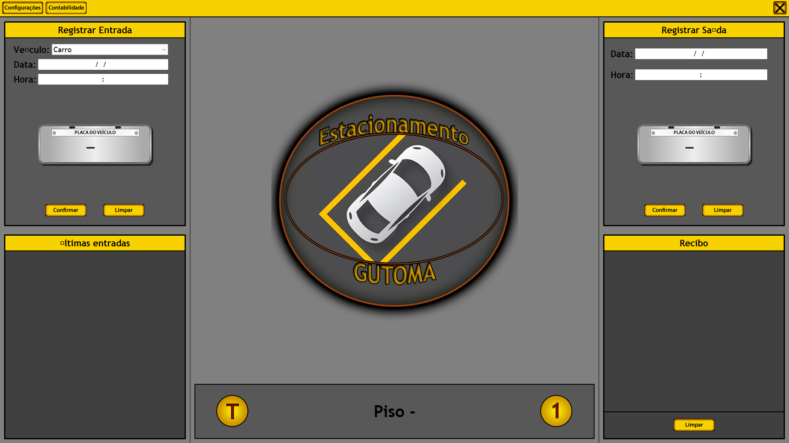
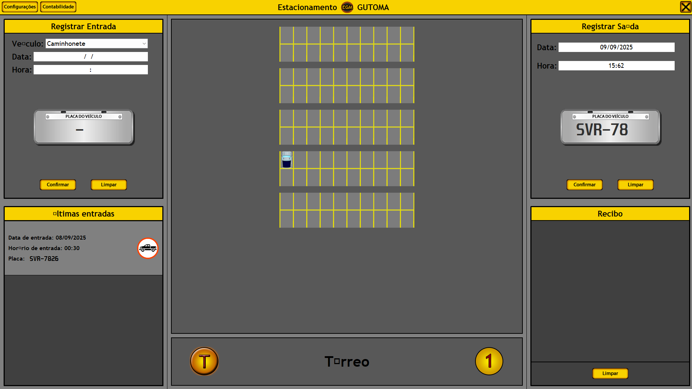
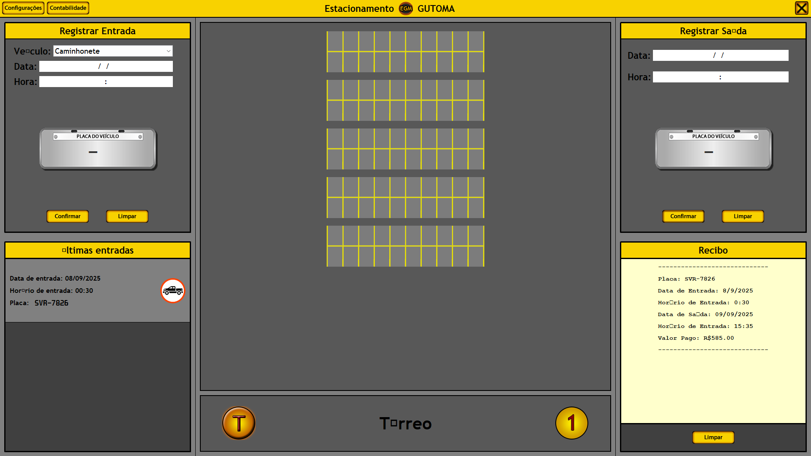
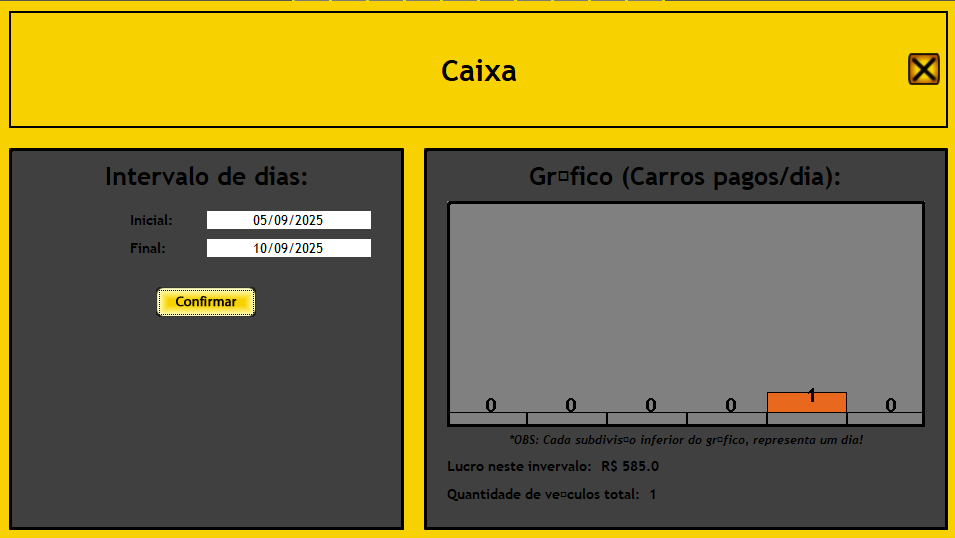

# ParkingLotSystem
A parking lot system written in Java

## Screen examples

_Main screen of GUTOMA's parking lot system_

_Example of car parked and about to leave_

_Printed receipt of last vehicle left_

_Chart profit of billed vehicles. You can set the interval!_